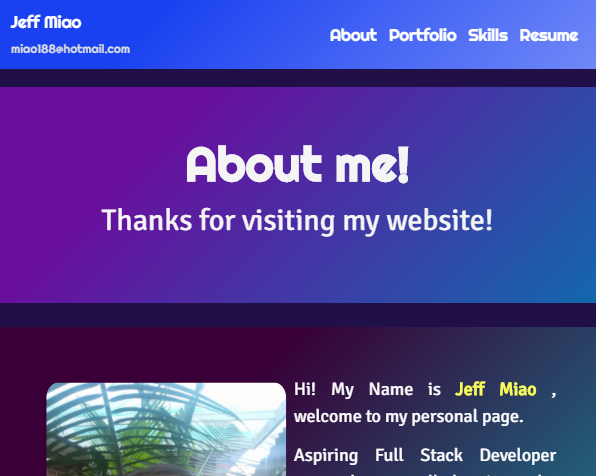

# React: Portfolio


## React Portfolio

## Live URL
https://react-portfolio-jeff.herokuapp.com/

## Description
To  create a portfolio using React.
## Table of Contents
* [License](#license)
* [Installation](#installation)
* [Tests](#tests)
* [Usage](#usage)
* [Credits](#credits)
* [Questions](#questions)

## Installation
``` Install Node.js first, and then run npm install , npm run start```
## Tests
``` npm start ```
## Usage
As a web developer, I want to build a portfolio using React and have multiple projects to share with people. Meanwhile, I want to be a part of a community. Having a place to share my projects for future employers.
## License
MIT

## Credits

* React

## Questions
GitHub: https://github.com/miao0007

Email: miao188@hotmail.com

## Deployed Site Preview

### Web Page
Header



Footer


